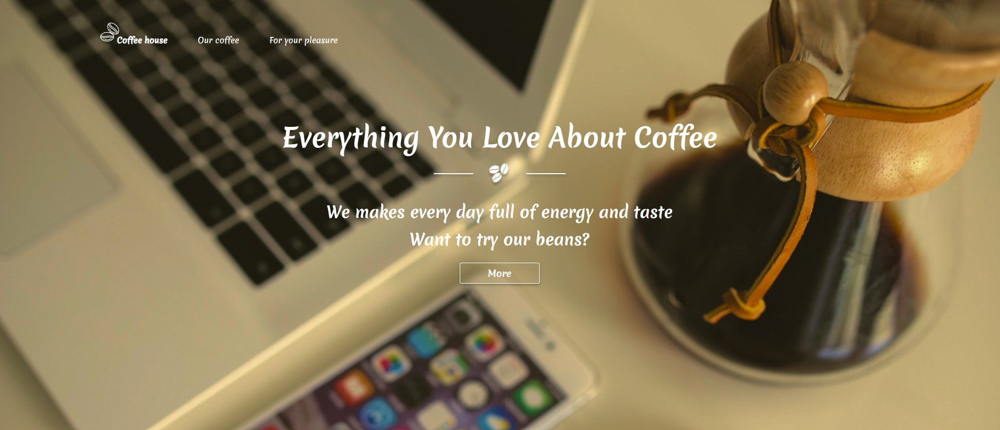
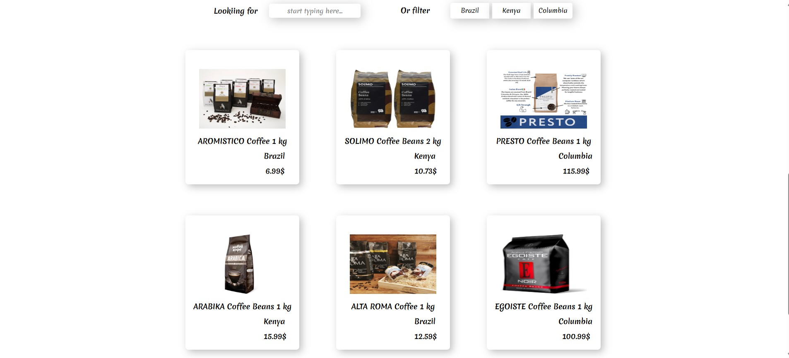

# 🌐 Coffee shop
A modern coffee shop website
---

## ✨ About the Project
Three-page coffee shop website showcasing different coffee products, offers, and brand story.
Built with clean layout, responsive design, and smooth user experience in mind.

---

## 🔧 Technologies Used

**Frontend**
- ⚛️ **React 18** — library for building user interfaces  
- 🧭 **React Router DOM 5** — client-side routing  
- 🎨 **Sass (SCSS)** — CSS preprocessor for styling  
- ⚖️ **normalize.css** — CSS normalization across browsers  

**Build & Configuration**
- ⚙️ **Create React App (react-scripts 5)** — build and development environment  

**Testing**
- 🧪 **@testing-library/react**, **@testing-library/jest-dom**, **@testing-library/user-event** — component testing utilities  

**Additional**
- 📊 **web-vitals** — measuring and reporting web performance metrics

---

## 🚀 Features
- Clean and minimalistic design
- Responsive layout

---

## 📸 Screenshots / Demo
  
  

**Live Demo:** [View Website](https://coffee-shop-4eca7.web.app/)

---

## 💻 Local Setup
To run the project locally:

```bash
git clone https://github.com/alexmiziuk/ShopCoffee.git
cd ShopCoffee
npm install
npm start
```

---

🧰 **Build Modes**

In the **"scripts"** section, several commands are defined for different environments:

| Command | Description |
|----------|--------------|
| **npm start** | Runs the app in development mode using the local development server |
| **npm run build** | Builds the app for production (optimized and minified) |
| **npm test** | Launches the test runner in interactive watch mode |
| **npm run eject** | Exposes the configuration files for full control (this action is irreversible) |

---

## 📄 License
MIT License © Oleksandr Miziuk

---

## ✉ Contacts
* **Email:** oleksandr.miziyk@gmail.com
* **GitHub:** [github.com/alexmiziuk](https://github.com/alexmiziuk)